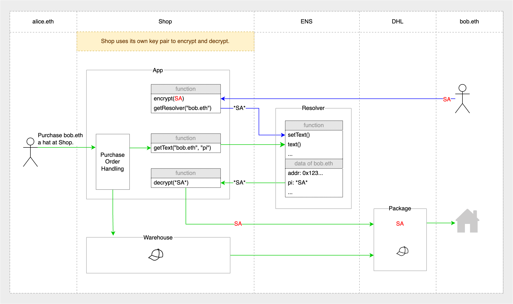
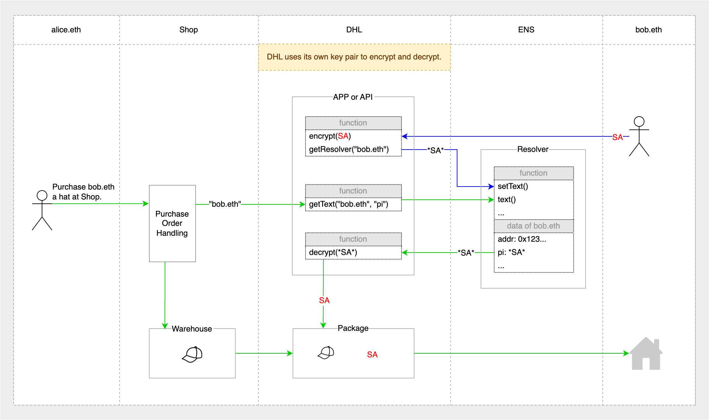

# A way to minimize the exposure of personal information using ENS

For various reasons, a lot of our personal information has been excessively collected by many people or services for reasonable reasons, which may lead to the abuse of information. We can use ENS to minimize the exposure of personal information and to some extent make it convenient for people. Here is an example to illustrate the idea.

Suppose Alice (alice.eth) wants to buy a hat from ensmerchshop.xyz (Shop) for Bob (bob.eth), the process would look something like this:

1. Alice contacts Bob in a private message to inquire about his Shipping Address (SA).
2. Alice orders a hat from Shop and fills in Bob's SA.
3. Shop provides the hat and SA together to the shipper (such as DHL).
4. DHL delivers the hat to SA and Bob got the hat.

In this example, there is one piece of personal information: Bob's Shipping Address (SA). In the above process, this personal information needs to be exposed to Alice, Shop and DHL, which is obviously a bit overexposed.

First of all, Alice does not need to package or deliver the hat in person, so she does not need to know the specific contents of the SA. She just needs to state that the hat she bought is to be delivered to bob.eth. So we have the 1st solution:

In the illustration above, the process becomes:

1. Bob saves the encrypted SA (\*SA\*) into the record of bob.eth in the App of Shop in advance. (one-time setting, indicated by blue lines)
2. Alice orders a hat from Shop and labels the recipient as "bob.eth".
3. Shop retrives \*SA\* from bob.eth's record and decrypts it as SA, then supplies the hat with SA to shipper DHL.
4. DHL delivers the hat to SA and Bob gets the hat.

In this process, Alice has not been exposed to the specific content of SA.

If we think about it more carefully, it is also unnecessary for Shop to know the specific content of SA, because only DHL, which is responsible for delivery, must know SA. In addition, in the 1st solution, ENS record \*SA\* of bob.eth can only be decrypted by Shop, which obviously limits the range of use of a record. So we have the 2nd solution:

In the illustration above, the process becomes:

1. Bob saves the encrypted SA (\*SA\*) in the record of bob.eth on DHL App/Api in advance. (one-time setting, indicated by blue lines)
2. Alice orders a hat from Shop and labels the recipient as "bob.eth".
3. Shop provides the hat together with the addressee's ENS name ("bob.eth") to shipper DHL.
4. DHL retrieves \*SA\* from bob.eth's record and decrypts it as SA, then delivers the hat to SA and Bob gets the hat.

In the whole process, neither Alice nor Shop had access to the specific content of SA.

Now, we have minimized the exposure of personal information.

While this is a simple example and covers only one scenario, there is definitely a lot of room for improvement in this approach, and many other scenarios could be applicable. That's it for now, very glad to share my thoughts here.

## Sample Code

[https://github.com/hibbb/minimize-exposure](https://github.com/hibbb/minimize-exposure)
